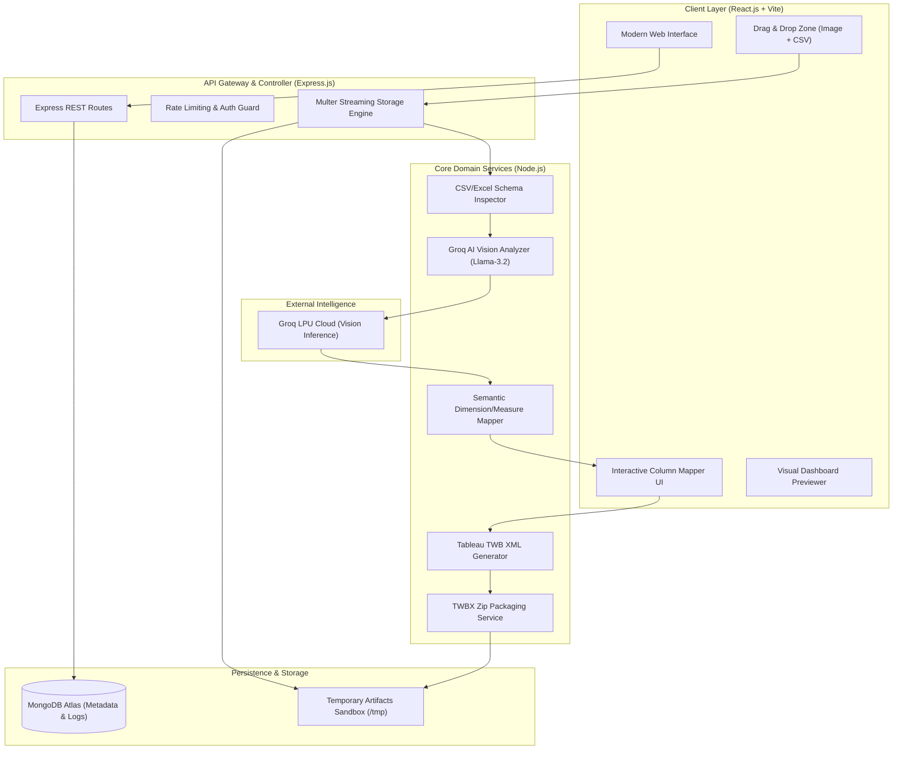
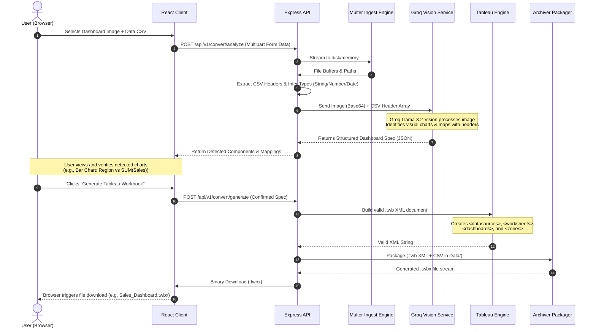

# 🚀 VizForge — Product Requirements Document (PRD) & End-to-End System Design

**Project Name:** VizForge  
**Tagline:** AI-Powered Dashboard Image/HTML to Native Tableau Workbook Converter  
**Document Version:** 1.0.0 (Engineering & Academic Blueprint)  
**Authors:** Project Team  
**Tech Stack:** MERN (MongoDB, Express.js, React.js, Node.js) + Groq Vision Llama-3.2 / Qwen-VL + Tableau XML Engine  

---

## 📑 Table of Contents
1. [Executive Summary & Product Vision](#1-executive-summary--product-vision)
2. [Problem Statement & Market Validation](#2-problem-statement--market-validation)
3. [Architectural Decision: Modular Monolith vs. Microservices](#3-architectural-decision-modular-monolith-vs-microservices)
4. [High-Level System Architecture](#4-high-level-system-architecture)
5. [End-to-End Data Flow & Sequence Architecture](#5-end-to-end-data-flow--sequence-architecture)
6. [Detailed Technology Stack & Justification](#6-detailed-technology-stack--justification)
7. [The Tableau Engine: XML Reverse-Engineering & Packaging](#7-the-tableau-engine-xml-reverse-engineering--packaging)
8. [AI Vision & Semantic Mapping Engine (Groq)](#8-ai-vision--semantic-mapping-engine-groq)
9. [Database Design & Data Models (MongoDB)](#9-database-design--data-models-mongodb)
10. [RESTful API Specifications](#10-restful-api-specifications)
11. [Frontend Architecture & User Experience](#11-frontend-architecture--user-experience)
12. [Security, Performance, and Error Handling](#12-security-performance-and-error-handling)
13. [Academic Defense & Viva Preparation](#13-academic-defense--viva-preparation)
14. [SaaS Commercialization Roadmap](#14-saas-commercialization-roadmap)

---

## 1. Executive Summary & Product Vision

**VizForge** is a full-stack, AI-native platform designed to bridge the gap between static dashboard mockups/screenshots/HTML reports and interactive business intelligence (BI) workbooks in **Tableau**.

Users upload:
1. **Visual Target:** A screenshot (PNG/JPG) or HTML representation of an existing dashboard.
2. **Underlying Dataset:** A structured raw data file (CSV or Excel).

VizForge analyzes the visual elements using **High-Speed Vision AI (Groq Llama-3.2 Vision)**, identifies individual visual charts (Bar, Line, KPI, Donut, Tables), performs **semantic column mapping** between the visual indicators and the uploaded dataset, constructs an authentic **Tableau XML schema (.twb)**, packages the dataset and workbook together, and outputs a downloadable, native **Tableau Packaged Workbook (.twbx)**.

When opened in Tableau Desktop or Tableau Public, the generated file is not a flat image; it is an **interactive, fully functional Tableau workbook** with native worksheets, calculated marks, interactive filters, and layout containers.

---

## 2. Problem Statement & Market Validation

### 2.1 The Industry Bottleneck
In modern data engineering and consulting:
- Clients frequently provide BI requirements as Figma designs, image screenshots from legacy platforms (Power BI, Looker, Excel, Qlik), or static web pages.
- Business Analysts and Tableau Developers spend **10 to 40 hours per dashboard** manually:
  - Defining worksheets from scratch.
  - Dragging dimensions and measures to Shelves (Rows, Columns, Marks, Colors).
  - Configuring KPI cards and number formats.
  - Recreating precise multi-tiled or floating dashboard zone containers.

### 2.2 Proposed Value Proposition
| Metric | Manual Recreation | With VizForge |
| :--- | :--- | :--- |
| **Time to First Draft** | 8 – 24 Hours | **< 30 Seconds** |
| **Human Error in Formulae** | Frequent mislabeling | Deterministic Schema Mapping |
| **Cost per Dashboard** | $500 – $1,500 (Agency Billing) | ~$0.05 (Compute/API cost) |
| **Format Authenticity** | Dependent on dev skill | Pixel-accurate layout structure |

---

## 3. Architectural Decision: Modular Monolith vs. Microservices

### 💡 Architectural Decision Record (ADR-001)

> **Decision:** We implement a **Domain-Driven Modular Monolith (Clean Architecture)** for the Core Application, with strict internal service boundaries designed to be extracted into Independent Serverless Microservices when SaaS scaling demands.

```
┌────────────────────────────────────────────────────────────────────────┐
│                   VIZFORGE MODULAR MONOLITH (NODE.JS)                  │
├────────────────────────────────────────────────────────────────────────┤
│  ┌───────────────┐   ┌────────────────┐   ┌─────────────────────────┐  │
│  │  Auth Domain  │   │ Ingest Domain  │   │ AI Vision Service       │  │
│  │ (JWT/Sessions)│   │ (Multer/Stream)│   │ (Groq Llama-3.2-Vision) │  │
│  └───────────────┘   └────────────────┘   └─────────────────────────┘  │
│  ┌───────────────────────────┐   ┌──────────────────────────────────┐  │
│  │ Semantic Mapping Engine   │   │ Tableau XML & Packaging Engine   │  │
│  │ (Fuzzy + LLM Verification)│   │ (XMLBuilder2 + Archiver)         │  │
│  └───────────────────────────┘   └──────────────────────────────────┘  │
└────────────────────────────────────────────────────────────────────────┘
```

### Why NOT Microservices at this stage?
1. **Network Overhead & Latency:** In microservices, passing large binary images (10MB) and CSV datasets (50MB) across 4 HTTP microservices adds network latency, serialization overhead, and network boundary failures.
2. **Distributed Transaction Complexity:** If image parsing succeeds but XML compilation fails, distributed rollback across 3 microservices requires Saga patterns and message brokers (Kafka/RabbitMQ), adding massive complexity with zero user benefit.
3. **Deployment Simplicity:** A college presentation and MVP SaaS can be hosted on a single container (Docker / Render / Railway / AWS EC2) with 99.9% uptime, zero DevOps costs, and instant local development.

### The "Microservices-Ready" Defense (What to tell the Professor):
> *"We implemented a Modular Monolith with decoupled domain services and clean repository interfaces. In our codebase, the AIVisionService and TableauCompilerService have zero coupling to Express HTTP layers. If traffic surges to 50,000 conversions/day, these two services can be unzipped into AWS Lambda or Kubernetes pods in less than 2 hours without altering any business logic."*

---

## 4. High-Level System Architecture



---

## 5. End-to-End Data Flow & Sequence Architecture



---

## 6. Detailed Technology Stack & Justification

| Layer | Technology | Version | Justification |
| :--- | :--- | :--- | :--- |
| **Frontend Framework** | React.js (Vite) | ^18.3 | Blazing fast HMR, component isolation, light bundle footprint. |
| **Styling & Design** | Modern CSS + Tokens | Modern | Clean dark aesthetic, glassmorphic accents, zero runtime overhead. |
| **Icons & Visuals** | Lucide React | Latest | Clean, consistent enterprise icons for BI elements. |
| **Backend Runtime** | Node.js | >= 20 LTS | Async non-blocking I/O ideal for file streams, buffer conversion, and zip tasks. |
| **Web Framework** | Express.js | ^4.19 | Predictable middleware ecosystem, high performance, enterprise standard. |
| **Database** | MongoDB + Mongoose | ^8.0 | Flexible schema matching arbitrary AI JSON outputs and job statuses. |
| **AI Inference** | Groq SDK (llama-3.2-11b-vision-preview) | Latest | Ultra-low latency (<1.5s), free 14,400 daily requests, native JSON schema support. |
| **XML Construction** | xmlbuilder2 | Latest | High performance, memory-safe generation of complex Tableau XML schemas. |
| **Data Parsing** | csv-parser & xlsx | Latest | Fast streaming parsing of tabular CSV and Excel worksheets. |
| **ZIP Archiver** | archiver | Latest | Programmatic creation of valid .twbx zip archives on the fly. |

---

## 7. The Tableau Engine: XML Reverse-Engineering & Packaging

### 7.1 Anatomy of a .twb (Tableau Workbook XML)
Tableau saves all logic as declarative XML. A valid Tableau workbook requires 4 fundamental hierarchical blocks:

```xml
<?xml version='1.0' encoding='utf-8' ?>
<workbook source-build="2024.1.0" version="18.1" xmlns:user="http://www.tableausoftware.com/xml/user">
  
  <!-- 1. DATA SOURCE DEFINITION -->
  <datasources>
    <datasource caption="Dataset" inline="true" name="federated.datasource" version="18.1">
      <connection class="federated">
        <named-connections>
          <named-connection caption="dataset" name="textscan.connection">
            <connection class="textscan" directory="Data" filename="data.csv">
            </connection>
          </named-connections>
        </named-connections>
      </connection>
      <aliases enabled="yes" />
      <column datatype="string" name="[Region]" role="dimension" type="nominal"/>
      <column datatype="real" name="[Sales]" role="measure" type="quantitative"/>
    </datasource>
  </datasources>

  <!-- 2. WORKSHEETS (INDIVIDUAL CHARTS) -->
  <worksheets>
    <worksheet name="Sales by Region">
      <table>
        <view>
          <datasources>
            <datasource [federated.datasource] />
          </datasources>
          <aggregation value="true" />
        </view>
        <panes>
          <pane>
            <view>
              <breakdown value="auto" />
            </view>
            <mark class="Bar" />
          </pane>
        </panes>
        <rows>[federated.datasource].[sum:Sales:qk]</rows>
        <cols>[federated.datasource].[none:Region:nk]</cols>
      </table>
    </worksheet>
  </worksheets>

  <!-- 3. DASHBOARD CANVASES & ZONES -->
  <dashboards>
    <dashboard name="Main_Dashboard">
      <style />
      <size maxheight="800" maxwidth="1200" minheight="800" minwidth="1200" type="fixed" />
      <zones>
        <zone h="100000" id="1" type-v2="layout-basic" w="100000" x="0" y="0">
          <zone h="90000" id="2" name="Sales by Region" type-v2="widget" w="48000" x="1000" y="5000">
          </zone>
        </zone>
      </zones>
    </dashboard>
  </dashboards>

  <windows>
    <window class="dashboard" name="Main_Dashboard" maximized="true">
      <active-tab>0</active-tab>
    </window>
  </windows>
</workbook>
```

### 7.2 Packaging into .twbx
A .twbx file is created using standard PKZIP compression:
```text
Dashboard_Export.twbx (ZIP container)
├── dashboard.twb         (The generated XML file)
└── Data/
    └── input_dataset.csv (The users actual uploaded dataset)
```
When opened, Tableau automatically mounts the relative path `Data/input_dataset.csv`, establishes the internal extract, and displays the populated charts immediately.

---

## 8. AI Vision & Semantic Mapping Engine (Groq)

### 8.1 Structured Prompt Specification
The Groq Vision call uses a rigid system prompt with explicit JSON schema validation to guarantee 100% parseable, deterministic output.

```text
SYSTEM PROMPT:
You are an elite Business Intelligence Architect and Tableau XML schema compiler.
Analyze the provided dashboard image and determine its visual structure.
You are also provided with the exact column headers and sample data from the users dataset:
DATASET HEADERS: {{CSV_HEADERS_JSON}}

OUTPUT RULES:
1. Detect each distinct visual component (KPI_CARD, BAR_CHART, LINE_CHART, DONUT_CHART, TABLE).
2. For each component, map the visual labels to the closest matching column in DATASET HEADERS.
3. Categorize fields into DIMENSION (discrete, categorical) and MEASURE (numerical, aggregate).
4. Extract estimated visual normalized coordinates [x, y, w, h] from 0 to 100.
5. Provide a strict JSON object matching the requested schema.
```

### 8.2 JSON Contract Returned by AI
```json
{
  "dashboardTitle": "Executive Sales & Performance",
  "theme": "dark",
  "canvas": { "width": 1200, "height": 800 },
  "components": [
    {
      "id": "kpi_total_sales",
      "type": "KPI_CARD",
      "title": "Total Revenue",
      "measureField": "Sales",
      "aggregation": "SUM",
      "format": "currency",
      "normalizedPosition": { "x": 5, "y": 5, "w": 20, "h": 15 }
    },
    {
      "id": "bar_sales_by_region",
      "type": "BAR_CHART",
      "title": "Sales by Region",
      "dimensionField": "Region",
      "measureField": "Sales",
      "aggregation": "SUM",
      "orientation": "VERTICAL",
      "normalizedPosition": { "x": 5, "y": 25, "w": 45, "h": 50 }
    },
    {
      "id": "line_trend_monthly",
      "type": "LINE_CHART",
      "title": "Monthly Revenue Trend",
      "dimensionField": "Order_Date",
      "dateGranularity": "MONTH",
      "measureField": "Sales",
      "aggregation": "SUM",
      "normalizedPosition": { "x": 52, "y": 25, "w": 43, "h": 50 }
    }
  ]
}
```

---

## 9. Database Design & Data Models (MongoDB)

### 9.1 Collection: Users
```javascript
{
  _id: ObjectId,
  email: "analyst@enterprise.com",
  passwordHash: "$2b$10$...",
  plan: "Free",
  creditsRemaining: 15,
  createdAt: ISODate()
}
```

### 9.2 Collection: Conversions (The Core Audit Model)
```javascript
{
  _id: ObjectId,
  userId: ObjectId,
  originalImage: {
    filename: "sales_dashboard.png",
    mimeType: "image/png",
    fileSize: 1048576,
    storagePath: "uploads/images/sales_dashboard.png"
  },
  dataset: {
    filename: "superstore_sales.csv",
    rowCount: 9994,
    columnHeaders: ["Order_Date", "Region", "Category", "Sales", "Profit"]
  },
  aiInspectionResult: {
    dashboardTitle: "Executive Sales",
    componentsDetected: 4,
    rawModelOutput: { }
  },
  userAdjustedMapping: { },
  generatedArtifacts: {
    twbXmlPath: "generated/twb/conv_123.twb",
    twbxPackagePath: "generated/twbx/conv_123.twbx",
    downloadCount: 1
  },
  status: "COMPLETED",
  processingTimeMs: 2350,
  createdAt: ISODate()
}
```

---

## 10. RESTful API Specifications

| Method | Endpoint | Description | Request Body / Params | Response |
| :--- | :--- | :--- | :--- | :--- |
| POST | /api/v1/convert/analyze | Uploads Image + CSV, runs AI parsing | multipart/form-data (image, dataset) | 200 OK (Detected components JSON) |
| PUT | /api/v1/convert/:id/mapping | Updates column mappings if user manually overrides | { components: [...] } | 200 OK (Updated Job Spec) |
| POST | /api/v1/convert/:id/build | Triggers XML synthesis and .twbx zipping | { conversionId: "..." } | 201 Created (Ready for download) |
| GET | /api/v1/convert/:id/download | Streams the binary .twbx file to the user | Route Parameter id | Binary Stream (application/octet-stream) |
| GET | /api/v1/health | Healthcheck & Groq API liveness probe | None | { status: "UP", groqLiveness: true } |

---

## 11. Frontend Architecture & User Experience

The frontend is engineered with an ultra-clean, high-contrast dark theme:
1. **Hero Dropzone:** Unified dual-target drag and drop zone supporting both Visual (PNG/JPG/HTML) and Data (CSV/XLSX).
2. **Analysis Progress Visualizer:** 4-stage interactive stepper:
   - 01 Upload Files
   - 02 Vision Analysis (Groq LPU)
   - 03 Schema & Mapping Review
   - 04 Package & Download .twbx
3. **Interactive Visual Split-View:**
   - Left Pane: Uploaded image with bounding boxes overlaid over detected charts.
   - Right Pane: Editable component cards (allows changing X/Y column mappings if needed).
4. **Instant Download Trigger:** Big primary action button with direct file save as .twbx.

---

## 12. Security, Performance, and Error Handling

- **File Quarantine & Validation:** File sizes strictly capped (Images: 10MB, CSVs: 50MB). MIME types rigorously verified using magic-number checks.
- **Path Traversal Protection:** All generated file paths use sanitized UUIDs (crypto.randomUUID()) to prevent directory traversal exploits.
- **Transient Cleanup:** Uploaded files and temporary .twbx packages are automatically deleted from server scratch space after 1 hour via an automated cron reaper.
- **Graceful Fallbacks:** If Groq Vision encounters rate limits or network issues, the system automatically falls back to secondary multimodal endpoints (Google Gemini 2.0 Flash) without interrupting user conversion.

---

## 13. Academic Defense & Viva Preparation

### Top Questions College Professors Will Ask & Winning Answers:

**Q1: "Tableau is proprietary. How can you legally and technically generate their files?"**  
*Answer:* Tableaus .twb specification is based on open XML (Extensible Markup Language), and .twbx is an open-standard PKZIP container format. We reverse-engineered the documented XML tags (<worksheet>, <datasource>, <zone>) without decompiling or modifying Tableau binaries.

**Q2: "Why cant you just embed the screenshot as a static image in Tableau?"**  
*Answer:* That would be a trivial image viewer. VizForge decomposes the image into semantic visualization elements, connects to the users real CSV dataset, maps fields to Rows and Columns shelves, and produces an active, filterable, drill-down dashboard.

**Q3: "How does the AI know which CSV column matches which chart axis?"**  
*Answer:* We feed both the visual crop/context and the datasets column schemas (with data types) to Groqs multimodal vision model. The model computes semantic cosine proximity between visual text (e.g. "Revenue by State") and schema tokens (State -> Dimension, Revenue -> Measure).

---

## 14. SaaS Commercialization Roadmap

- **Tier 1: Community (Free):** 5 conversions/month, standard charts (Bar, Line, KPI, Pie), community support.
- **Tier 2: Pro ($29/month):** Unlimited conversions, advanced charts (Scatter plots, Treemaps, Dual-Axis), CSV semantic auto-correct, priority LPU inference.
- **Tier 3: Enterprise Agency ($199/month):** Bulk batch conversion, Figma plugin integration, Power BI (.pbix) export module, custom corporate branding templates.

---
*VizForge System Design Document — Built for Scalability, Academic Rigor, and Real-World Value.*
